# Mini Compiler / Interpreter

A small teaching compiler written in C11 that takes a source file in a tiny
statically-typed language, runs it through the four classic front-end phases —
**lexical analysis → syntax analysis → semantic analysis → execution** — and
prints the intermediate result of every phase before evaluating the program.

Unlike a "real" compiler it stops before code generation: instead of emitting
assembly, it walks the AST directly and interprets it. That makes every stage
observable in a single run, which is the point of the project.

---

## Table of contents

- [The language](#the-language)
- [Setup](#setup)
- [Testing](#testing)
- [Compilation pipeline](#compilation-pipeline)
- [Module layout](#module-layout)
- [Phase 1 — Lexer](#phase-1--lexer)
- [Phase 2 — Parser](#phase-2--parser)
- [Phase 3 — Semantic analysis](#phase-3--semantic-analysis)
- [Phase 4 — Execution](#phase-4--execution)
- [Worked example](#worked-example)
- [Data structures](#data-structures)
- [Error handling](#error-handling)
- [Extending the language](#extending-the-language)

---

## The language

The supported language is deliberately minimal:

```c
int x = 20;
float y = 2.5;
int z = x + 10;
z = z + x;
print(z);
```

| Feature | Supported |
| --- | --- |
| Types | `int`, `float` |
| Declaration | `int x;` and `int x = <expr>;` |
| Assignment | `x = <expr>;` |
| Operators | `+` (left-associative), `=` |
| Grouping | `( <expr> )` |
| Built-ins | `print(<expr>);` |
| Comments, control flow, functions | ✗ not supported |

### BNF grammar

```bnf
<program>        ::= <stmt_list>

<stmt_list>      ::= <stmt> <stmt_list>
                   | <stmt>

<stmt>           ::= <decl>
                   | <assign>
                   | <built_in_call>

<decl>           ::= <type> <identifier> ";"
                   | <type> <identifier> "=" <expr> ";"

<assign>         ::= <identifier> "=" <expr> ";"

<built_in_call>  ::= <built_in_name> "(" <expr> ")" ";"

<built_in_name>  ::= "print"

<type>           ::= "int" | "float"

<expr>           ::= <term> { "+" <term> }*

<term>           ::= <number>
                   | <identifier>
                   | "(" <expr> ")"
```

Token-level definitions handled by the lexer:

```bnf
IDENTIFIER_TOKEN ::= [A-Za-z_] { [A-Za-z0-9_] }*
NUMBER_TOKEN     ::= [0-9]+ ( "." [0-9]+ )?
```

---

## Setup

### Prerequisites

| Requirement | Notes |
| --- | --- |
| A C11 compiler | `gcc`, or Apple `clang` (which answers to `gcc` on macOS) |
| `make` | Any version; the Makefile uses no GNU-specific features |
| POSIX `<regex.h>` | Part of libc on macOS and Linux — nothing to install |

There are **no third-party dependencies**. The only non-C89 library used is
POSIX `<regex.h>`, which ships with the system on any Unix-like platform.

<details>
<summary><b>Platform-specific setup</b></summary>

**macOS** — install the Command Line Tools, which provide `clang` and `make`:

```bash
xcode-select --install
```

**Debian / Ubuntu**

```bash
sudo apt update && sudo apt install build-essential
```

**Fedora / RHEL**

```bash
sudo dnf install gcc make
```

**Windows** — build under WSL, MSYS2, or Cygwin. Native MSVC will not work
without changes, because `<regex.h>` is POSIX-only.

</details>

Verify your toolchain:

```bash
gcc --version
make --version
```

### Get the code

```bash
git clone <repository-url>
cd compiler
```

### Build

The project ships in two equivalent forms: a **modular build** (one file per
phase) and a **single-file amalgamation** (`compiler.c`) that contains the exact
same code in one translation unit. Either one produces the same behaviour.

**Modular build (via Makefile):**

```bash
make            # builds ./parcer from main.c lexer.c parser.c semantics.c execute.c
make run        # builds and runs ./parcer input.txt
make clean      # removes the binary and object files
```

**Single-file build:**

```bash
gcc -Wall -Wextra -Wpedantic -std=c11 -g -o compiler compiler.c
```

Both builds are warning-clean under `-Wall -Wextra -Wpedantic`. If you see
warnings, that is a regression worth investigating.

### Verify the install

```bash
make clean && make && ./parcer test_types.txt
```

The last line before the blank line should be `15.5`. If you see that, the
whole pipeline works.

---

## Testing

There is no unit-test framework — the compiler is verified by running sample
programs and checking their output. Every phase prints its intermediate result,
so a failure is easy to localise to a specific phase.

### Usage

```bash
./parcer <source_file>
```

The program takes exactly one argument. It prints, in order: the token stream,
the AST, the symbol table, and finally the program's own output. On any error it
writes a message to `stderr` and exits with status `1`; a successful run exits
`0`.

### Bundled sample programs

| File | What it covers | Expected result |
| --- | --- | --- |
| [test_types.txt](test_types.txt) | `int`/`float` mixing and implicit widening | prints `15.5`, exit `0` |
| [test_complex.txt](test_complex.txt) | ~40 statements: long `+` chains, reassignment, recomputation | prints 36 values ending `1105`, `44.3`; exit `0` |
| [input.txt](input.txt) | **Deliberate failure case** — declares `y` twice | `Semantic error (line 3): variable 'y' already declared`, exit `1` |

Run them:

```bash
./parcer test_types.txt
./parcer test_complex.txt
./parcer input.txt          # expected to fail — see above
```

To see only the program's own output, skip past the diagnostic dumps:

```bash
./parcer test_complex.txt | sed -n '/^──/,$p' | grep -v '^[a-z]' 
```

### Testing each phase in isolation

Because every phase prints its result, you can confirm a phase independently by
reading the corresponding block of output:

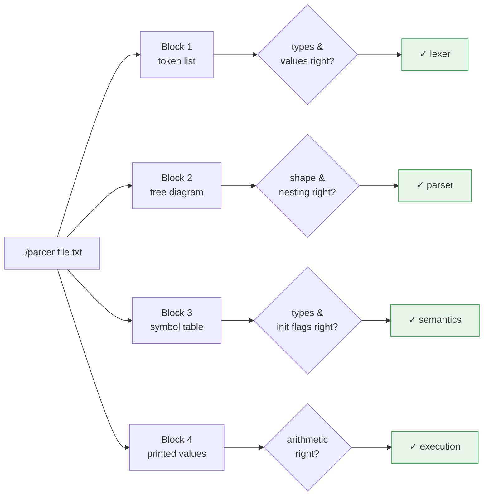

For example, to check only that left-associativity is built correctly, look at
the AST block and ignore the rest:

```bash
printf 'int a = 1 + 2 + 3;\nprint(a);\n' > /tmp/assoc.txt
./parcer /tmp/assoc.txt
```

The `Expression: +` nodes should nest to the **left**, and the program should
print `6`.

### Error-case tests

Each of these is a one-liner that exercises a different failure path. All exit
with status `1`.

| Test program | Phase that catches it | Exact message |
| --- | --- | --- |
| `int x = 5;`<br/>`x = 1 @ 2;` | Lexer | `Lexical error: invalid token '@'` |
| `int x = 5` | Parser | `Parse error: expected ';' after declaration` |
| `int x = 5;`<br/>`int x = 6;` | Semantics | `Semantic error (line 2): variable 'x' already declared` |
| `int x = 5;`<br/>`y = 3;` | Semantics | `Semantic error (line 2): undeclared variable 'y'` |
| `int x = 2.5;` | Semantics | `Semantic error (line 1): cannot assign float to int variable 'x'` |
| `int x;`<br/>`print(x);` | Execution | `Runtime error: variable 'x' not defined` |

Run one by hand:

```bash
printf 'int x = 2.5;\n' > /tmp/narrow.txt
./parcer /tmp/narrow.txt; echo "exit=$?"
```

### A regression script

Paste this into `run_tests.sh` to check every case above in one go:

```bash
#!/usr/bin/env bash
# Regression suite: verifies the four sample outcomes and six error paths.
set -u
BIN=./parcer
TMP=$(mktemp -d)
pass=0; fail=0

# check <name> <expected-exit> <expected-substring-in-output> <source-text>
check() {
  local name=$1 want_exit=$2 want_text=$3 src=$4
  printf '%b' "$src" > "$TMP/t.txt"
  out=$("$BIN" "$TMP/t.txt" 2>&1); got_exit=$?
  if [ "$got_exit" = "$want_exit" ] && printf '%s' "$out" | grep -qF "$want_text"; then
    echo "PASS  $name"; pass=$((pass+1))
  else
    echo "FAIL  $name (exit=$got_exit, wanted $want_exit containing '$want_text')"
    fail=$((fail+1))
  fi
}

# --- successful programs ---
check "int arithmetic"     0 "6"    'int a = 1 + 2 + 3;\nprint(a);\n'
check "float widening"     0 "7.5"  'int a = 5;\nfloat b = 2.5;\nfloat c = a + b;\nprint(c);\n'
check "parenthesised expr" 0 "9"    'int a = 2;\nprint((a + 3) + 4);\n'
check "reassignment"       0 "42"   'int a = 1;\na = 42;\nprint(a);\n'

# --- error paths ---
check "lexical error"      1 "Lexical error: invalid token '@'"                     'int x = 5;\nx = 1 @ 2;\n'
check "missing semicolon"  1 "Parse error: expected ';' after declaration"          'int x = 5\n'
check "redeclaration"      1 "already declared"                                     'int x = 5;\nint x = 6;\n'
check "undeclared var"     1 "undeclared variable 'y'"                              'int x = 5;\ny = 3;\n'
check "narrowing assign"   1 "cannot assign float to int variable 'x'"              'int x = 2.5;\n'
check "uninitialised read" 1 "Runtime error: variable 'x' not defined"              'int x;\nprint(x);\n'

# --- bundled samples ---
check "test_types sample"  0 "15.5" "$(cat test_types.txt)"

rm -rf "$TMP"
echo
echo "$pass passed, $fail failed"
[ "$fail" -eq 0 ]
```

Then:

```bash
chmod +x run_tests.sh
./run_tests.sh
```

The script exits `0` only when every case passes, so it can be dropped straight
into CI.

### Checking for memory leaks

Every AST node comes from `malloc` and is released by `free_ast()`. To confirm
nothing leaks:

```bash
# Linux
valgrind --leak-check=full ./parcer test_complex.txt

# macOS — build with the sanitizer instead, since valgrind is unreliable on arm64
gcc -Wall -Wextra -std=c11 -g -fsanitize=address,undefined -o parcer_asan \
    main.c lexer.c parser.c semantics.c execute.c
./parcer_asan test_complex.txt
```

Note that the error paths call `exit(1)` without freeing the AST, so leak
reports on *failing* programs are expected and harmless — check leaks with a
program that runs to completion.

### Writing your own test program

Stick to what the grammar supports — `int`/`float` declarations, `+`,
parentheses, assignment, and `print`. A useful template:

```c
int a = 5;
float b = 2.5;
int c = a + 10;      /* int + int stays int          */
float d = a + b;     /* mixing promotes to float     */
c = c + a;           /* reassignment                 */
print(c);
print(d);
```

Save it as `mytest.txt` and run `./parcer mytest.txt`. Watch for the pitfalls
the language does *not* support: comments (the `/* */` above are for this
document only — they are a lexical error), `-`, `*`, `/`, control flow, and
functions. See [Extending the language](#extending-the-language) for how to add
them.

> **Naming note:** the Makefile target is spelled `parcer` (matching the original
> assignment's spelling), and a `parser` binary of the same program is also
> checked in. `compiler` is the single-file build. All three do the same thing.

---

## Compilation pipeline

Each phase consumes the output of the previous one. `main()` drives them in
sequence and prints the intermediate representation after each step.

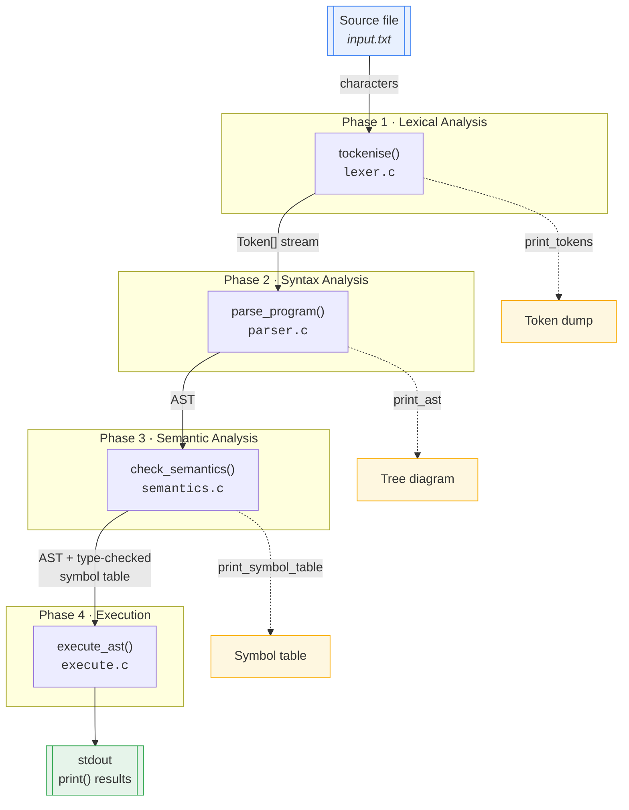

A textbook compiler continues past this point:

```
Source → Lexer → Parser → AST → Semantic Analysis → IR → Optimisation → Codegen → Machine code
                                                    └──────── not implemented ────────┘
                                                    this project interprets the AST instead
```

---

## Module layout

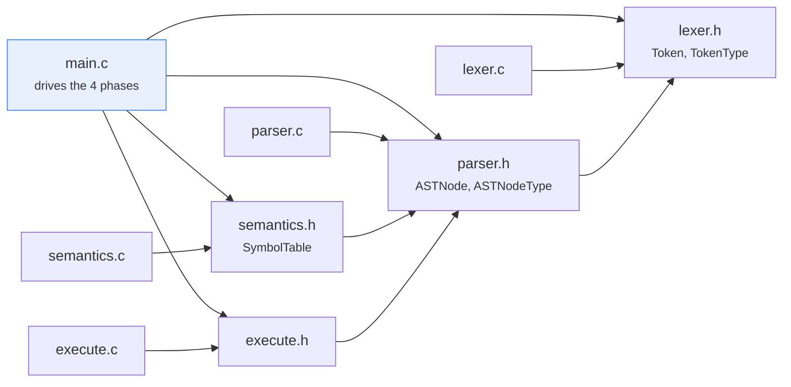

| File | Lines | Responsibility |
| --- | --- | --- |
| [main.c](main.c) | 35 | Argument handling, phase sequencing, cleanup |
| [lexer.c](lexer.c) / [lexer.h](lexer.h) | 222 / 35 | Character scanning, token classification |
| [parser.c](parser.c) / [parser.h](parser.h) | 319 / 35 | Recursive-descent parsing, AST build & print |
| [semantics.c](semantics.c) / [semantics.h](semantics.h) | 238 / 29 | Symbol table, declaration & type checking |
| [execute.c](execute.c) / [execute.h](execute.h) | 243 / 9 | Runtime store, expression evaluation, `print` |
| [compiler.c](compiler.c) | 1012 | All of the above, amalgamated into one file |

The dependency chain is strictly one-directional — `lexer` knows nothing about
the parser, the parser knows nothing about semantics, and so on. `ASTNode`
carries the original `TokenType` from the lexer so later phases can distinguish
an identifier term from a numeric literal without re-inspecting the text.

---

## Phase 1 — Lexer

[`tockenise()`](lexer.c) reads the file one character at a time, accumulating
characters into a buffer and flushing that buffer into a token whenever it hits
whitespace, a symbol, or an operator.

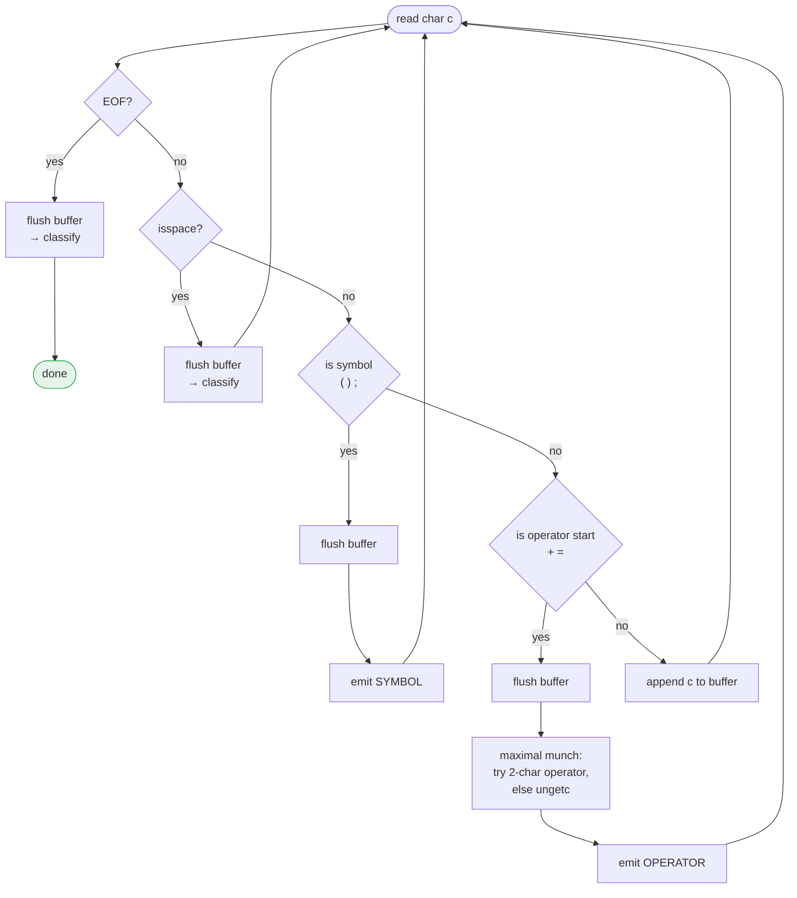

### Classifying a flushed buffer

Buffer contents are matched in a fixed priority order, so `int` is a keyword
rather than an identifier and `print` is a built-in rather than an identifier:

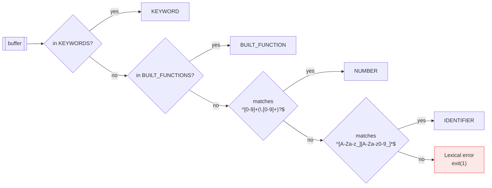

Number and identifier shapes are checked with POSIX `<regex.h>` patterns
compiled once per run. The keyword, built-in, operator, and symbol vocabularies
are plain string tables at the top of [lexer.c](lexer.c) — adding a token is a
one-line change there.

**Token types:** `KEYWORD`, `BUILT_FUNCTION`, `IDENTIFIER`, `NUMBER`,
`OPERATOR`, `SYMBOL`, `END`.

Tokens land in a fixed global array `Token tokenArray[1000]`, and `tokenCount`
records how many were produced.

---

## Phase 2 — Parser

A textbook **recursive-descent** parser. Each grammar production gets one
function, and the call graph mirrors the BNF exactly:

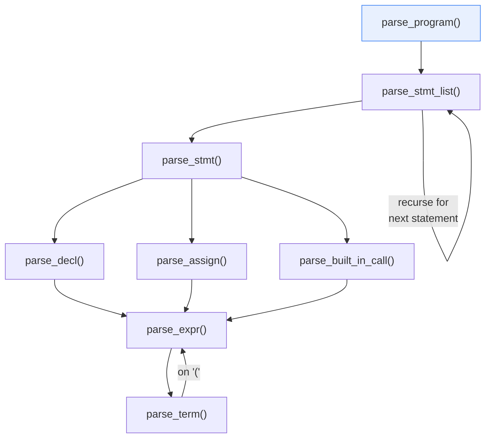

Dispatch in `parse_stmt()` needs only **one token of lookahead**, because each
statement form starts with a distinct token type:

| Lookahead token type | Production chosen |
| --- | --- |
| `BUILT_FUNCTION` | `<built_in_call>` |
| `KEYWORD` (`int`/`float`) | `<decl>` |
| `IDENTIFIER` | `<assign>` |

The token cursor is the global `currentToken`, manipulated only through the
helpers `peek()`, `consume()`, `match(type)` and `match_value(text)`.

### AST shape

Every node is the same `ASTNode` struct, with `left`, `right`, and `next`
pointers reused differently per node type:

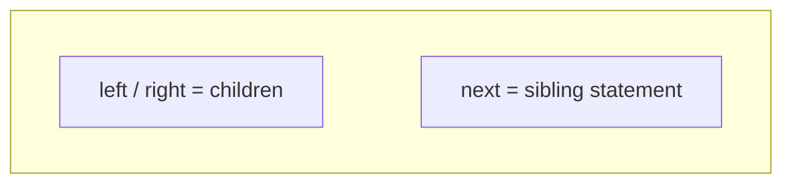

| Node type | `value` | `left` | `right` | `next` |
| --- | --- | --- | --- | --- |
| `NODE_PROGRAM` | `"program"` | first statement | — | — |
| `NODE_DECL` | `"int"` / `"float"` | identifier term | init expression (or `NULL`) | next statement |
| `NODE_ASSIGN` | variable name | expression | — | next statement |
| `NODE_BUILT_IN_CALL` | `"print"` | argument expression | — | next statement |
| `NODE_EXPR` | operator (`"+"`) | left operand | right operand | — |
| `NODE_TERM` | literal or name | — | — | — |

Statements form a linked list through `next`; expressions form a binary tree
through `left`/`right`. So the program is really a **list of trees**:

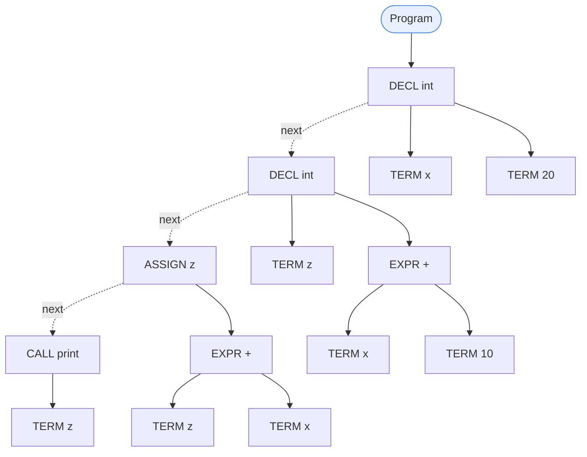

### Left-associativity

`parse_expr()` builds `a + b + c` iteratively, re-rooting the tree on each
iteration so the leftmost addition binds tightest:

```
a + b + c   →      +
                  / \
                 +   c
                / \
               a   b
```

`print_ast()` renders the whole structure with box-drawing characters, which is
what you see in the second block of program output.

---

## Phase 3 — Semantic analysis

The parser accepts anything that is *grammatically* well-formed. Semantic
analysis catches the things a grammar cannot express: undeclared variables,
duplicate declarations, and type errors.

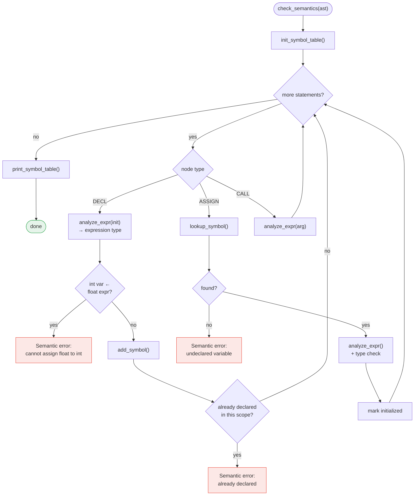

### Symbol table

A flat array of `SymbolEntry` records, each holding name, type, an
`isInitialized` flag, a scope level, and the declaring line number. Because the
language has no blocks or functions, every symbol currently sits at scope `0` —
the field exists so nested scopes can be added without reshaping the table.

Printed after analysis as:

```
Name            Type       Initialized  Scope    Line
─────────────────────────────────────────────────────────────────
y               int        Yes          0        1
x               int        Yes          0        2
z               int        Yes          0        3
```

### Type rules

`analyze_expr()` is a dispatcher that returns the *type* of a subexpression;
`analyze_arithmetic_expr()` applies the promotion rules:

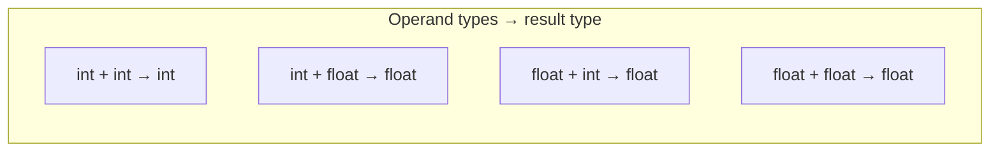

Assignment compatibility, checked for both declarations and assignments:

| Target | Source `int` | Source `float` |
| --- | --- | --- |
| `int` | ✓ | ✗ **error** — narrowing is rejected |
| `float` | ✓ implicit widening | ✓ |

A literal's type comes from its spelling: a `.` in the token makes it `float`,
otherwise `int`.

The design anticipates more operator families — see
[resources/symantics.txt](resources/symantics.txt), which sketches
`analyze_comparison_expr` and `analyze_logical_expr` alongside the arithmetic
handler.

---

## Phase 4 — Execution

With the AST validated, [`execute_ast()`](execute.c) walks the statement list
and evaluates it directly — a **tree-walking interpreter**.

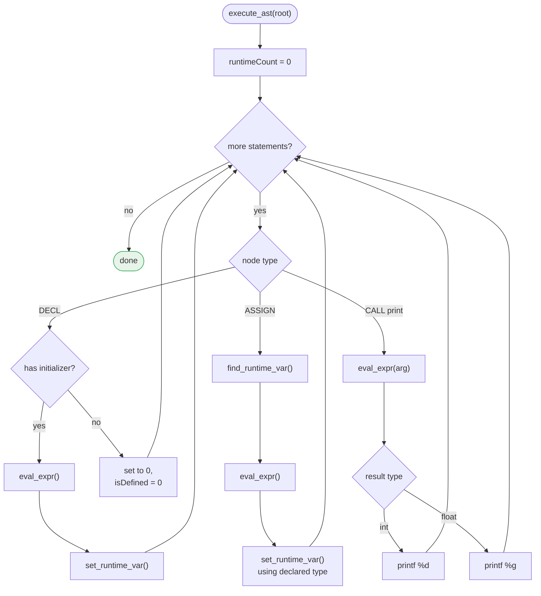

### Runtime value model

All arithmetic happens in `double`, with the static type carried alongside as a
string so `print` knows which format specifier to use and so `int` variables get
truncated on store:

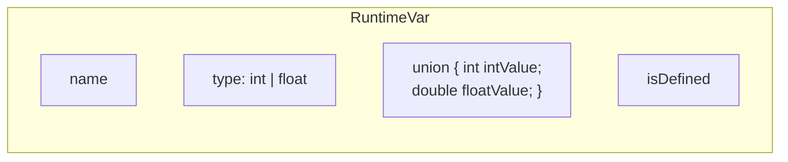

`eval_expr()` mirrors `analyze_expr()` from the semantic phase — same recursive
descent over `NODE_EXPR` / `NODE_TERM`, same int/float promotion rule — but it
returns a *value* instead of a type. Declaring a variable without an initializer
zeroes it and clears `isDefined`, so reading it later raises a runtime error.

Finally `free_ast()` recursively frees `left`, `right`, and `next`, releasing
the whole tree.

---

## Worked example

Here is the run captured in [output.txt](output.txt). Note that the checked-in
[input.txt](input.txt) additionally contains a duplicate `int y = 67;` line, which
deliberately trips the redeclaration check — remove it to reproduce the run below.


```c
int y = 10 ;
int x = 20;
int z = x + y ;
print(z);
```

**Phase 1 output — token stream:**

```
KEYWORD: int      IDENTIFIER: y     OPERATOR: =     NUMBER: 10     SYMBOL: ;
KEYWORD: int      IDENTIFIER: x     OPERATOR: =     NUMBER: 20     SYMBOL: ;
KEYWORD: int      IDENTIFIER: z     OPERATOR: =     IDENTIFIER: x
OPERATOR: +       IDENTIFIER: y     SYMBOL: ;
BUILT_FUNCTION: print   SYMBOL: (   IDENTIFIER: z   SYMBOL: )   SYMBOL: ;
```

**Phase 2 output — AST:**

```
Program
├── Declaration: int
│   ├── Term: y
│   └── Term: 10
├── Declaration: int
│   ├── Term: x
│   └── Term: 20
├── Declaration: int
│   ├── Term: z
│   └── Expression: +
│       ├── Term: x
│       └── Term: y
└── Built-in Call: print()
    └── Term: z
```

**Phase 3 output — symbol table:**

```
Name            Type       Initialized  Scope    Line
─────────────────────────────────────────────────────────────────
y               int        Yes          0        1
x               int        Yes          0        2
z               int        Yes          0        3
```

**Phase 4 output — program result:**

```
30
```

End to end:

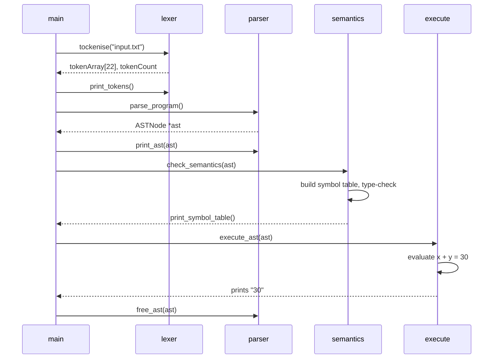

---

## Data structures

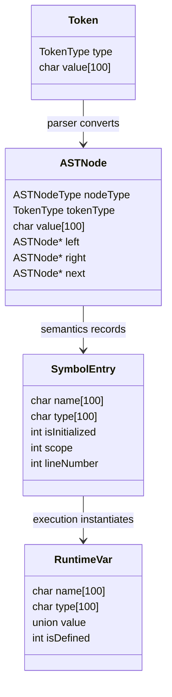

### Capacity limits

| Constant | Value | Meaning |
| --- | --- | --- |
| `MAX_TOKENS` | 1000 | Tokens per program, and symbol-table capacity |
| `MAX_LEN` | 100 | Longest identifier / token text |
| `MAX_RUNTIME_VARS` | 100 | Live variables at runtime |

All storage is statically allocated except AST nodes, which come from `malloc`
and are freed by `free_ast()`.

---

## Error handling

Every phase reports to `stderr` and calls `exit(1)` on the first error — there
is no error recovery or multi-error reporting.

| Phase | Error | Message |
| --- | --- | --- |
| Lexer | Unrecognisable token text | `Lexical error: invalid token 'xyz'` |
| Parser | Missing `;`, `)`, identifier, … | `Parse error: expected ';' after declaration` |
| Parser | Statement starting with a bad token | `Parse error: unexpected token '...'` |
| Semantics | Redeclaration | `Semantic error (line N): variable 'x' already declared` |
| Semantics | Use before declaration | `Semantic error: undeclared variable 'x'` |
| Semantics | Narrowing assignment | `Semantic error (line N): cannot assign float to int variable 'x'` |
| Runtime | Read of an uninitialised variable | `Runtime error: variable 'x' not defined` |

The bundled [input.txt](input.txt) currently contains a duplicate declaration of
`y`, which is a deliberate trigger for the redeclaration check.

---

## Extending the language

The vocabulary tables and the phase-per-construct structure make most additions
mechanical. To add a new binary operator such as `-`:

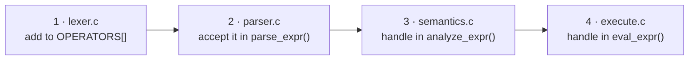

Other natural next steps, in rough order of effort:

- **Operator precedence** — split `parse_expr()` into `parse_expr` / `parse_more`
  layers so `*` and `/` bind tighter than `+` and `-`.
- **More built-ins** — `BUILT_FUNCTIONS[]` in the lexer plus a branch in
  `execute_stmt()`; the parser already handles any built-in name generically.
- **Line numbers in the lexer** — currently `lineCounter` in the semantic phase
  counts *statements*, not source lines, so error positions are approximate.
- **Real scopes** — the `scope` field already exists on `SymbolEntry`; adding
  blocks means pushing/popping scope levels in `check_semantics()`.
- **Code generation** — replace `execute.c` with an IR emitter to complete the
  classic pipeline shown in [resources/process.txt](resources/process.txt).

---

## Repository contents

```
compiler/
├── main.c              phase driver
├── lexer.{c,h}         Phase 1 — tokenisation
├── parser.{c,h}        Phase 2 — recursive-descent parsing + AST
├── semantics.{c,h}     Phase 3 — symbol table + type checking
├── execute.{c,h}       Phase 4 — tree-walking interpreter
├── compiler.c          single-file amalgamation of all of the above
├── Makefile            builds the modular version as ./parcer
├── input.txt           demo program
├── test_types.txt      int/float promotion cases
├── test_complex.txt    ~40-statement stress test
├── output.txt          captured run of input.txt
└── resources/
    ├── parcer2.txt     the BNF grammar
    ├── parserInfo.txt  parser call-graph sketch
    ├── process.txt     the full textbook compiler pipeline
    └── symantics.txt   planned analyze_* dispatch structure
```
